# COMP 440: Online Store Database Project

### Phase 1 Video Link: https://youtu.be/wrSrChX4lJ4
### Phase 2 Video Link: https://youtu.be/G10_A5QId_U

## Overview

This project implements a secure, full-stack online marketplace web application for the COMP 440 Database Design course (Summer 2025). The application currently supports comprehensive functionality including:

- **User Authentication**: Complete registration, login, logout, and session management
- **Item Management**: Users can post items for sale with categories, descriptions, and pricing (2 items per day limit)
- **Search & Discovery**: Category-based search functionality with autocomplete and quick category buttons
- **Review System**: Users can write reviews (Excellent/Good/Fair/Poor) with daily limits and star ratings
- **Advanced Analytics**: Comprehensive reporting system with database queries for user behavior and item performance analysis
- **User Profiles**: Profile management, user following system, and seller pages

The application emphasizes security with parameterized queries, input validation, and hashed password storage to protect against SQL injection attacks.

## Product Vision

- **Secure & Robust**: Protect all database operations using parameterized queries, input validation, and least-privilege database accounts. Passwords are hashed before storage.
- **Modern Stack**: Python 3.10 + Flask backend, MySQL database, and React 18 frontend for a responsive and maintainable codebase.
- **Phased Delivery**: Development follows three course phases, each delivering a working increment of functionality:
  1. User Authentication (registration & login)
  2. Item Posting, Searching & Reviewing  
  3. Advanced Queries & Analytics
  4. Social Features

## Tech Stack

- **Backend**: Python 3.10, Flask, Flask-Login, PyMySQL, bcrypt
- **Frontend**: React 18, Vite, React Router DOM  
- **Database**: MySQL 8.4 LTS
- **ORM / Querying**: SQLAlchemy for parameterized SQL queries
- **Security**: Input validation, parameterized statements, and hashed passwords using bcrypt
- **Development**: Concurrently for running frontend/backend simultaneously

## Project Structure

```
/ (root)
├── backend/                    # Flask application
│   ├── app.py                  # Flask entry point & blueprint registration
│   ├── config.py               # Configuration (env variables, database URI)
│   ├── models.py               # SQLAlchemy models (User, Item, Category, Review, Follow)
│   ├── requirements.txt        # Python dependencies
│   └── routes/                 # API Blueprint modules
│       ├── __init__.py         # Routes package initialization
│       ├── auth.py             # Authentication (register, login, logout, status)
│       ├── items.py            # Item management (create, list, search, categories)
│       ├── users.py            # User CRUD operations
│       ├── reviews.py          # Review system (create, list, ratings)
│       └── reports.py          # Analytics & advanced queries
├── frontend/                   # React application  
│   ├── public/                 # Static assets
│   ├── src/                    # React components, pages, and styles
│   │   ├── App.jsx             # Main app router
│   │   ├── index.jsx           # React app entry point
│   │   ├── components/         # Reusable UI components
│   │   │   ├── ItemList.jsx    # Item listing display
│   │   │   ├── Navbar.jsx      # Navigation component
│   │   │   ├── NewItemForm.jsx # Item creation form
│   │   │   ├── ReviewForm.jsx  # Review submission form
│   │   │   ├── SearchInterface.jsx # Search functionality
│   │   │   ├── StarRating.jsx  # Star rating display
│   │   │   └── Users.jsx       # User management component
│   │   ├── contexts/           # React context providers
│   │   │   └── ItemsListContext.jsx # Items state management
│   │   ├── pages/              # Page components
│   │   │   ├── FrontPage.jsx   # Public homepage
│   │   │   ├── Login.jsx       # Login page
│   │   │   ├── Register.jsx    # Registration page
│   │   │   ├── ItemPage.jsx    # Individual item details
│   │   │   ├── ItemManagement.jsx # Item management dashboard
│   │   │   ├── Reports.jsx     # Analytics dashboard
│   │   │   ├── SearchResults.jsx # Search results page
│   │   │   ├── Seller.jsx      # Seller profile page
│   │   │   └── UserProfile.jsx # User profile management
│   │   └── styles/             # CSS stylesheets
│   │       ├── global.css      # Global styles
│   │       ├── components/     # Component-specific styles
│   │       └── pages/          # Page-specific styles
│   ├── package.json            # Frontend dependencies & scripts
│   └── vite.config.js          # Vite configuration with proxy
├── package.json                # Global dependencies & scripts  
└── README.md                   # This file
```

## Database Schema

```mermaid
erDiagram
    USER {
        string  username PK
        string  password
        string  firstName
        string  lastName
        string  email UK
    }

    ITEM {
        int     id PK
        string  title
        text    description
        date    date_posted
        decimal price "NUMERIC(10,2)"
        string  posted_by FK "user.username"
        float   star_rating
        string  image_url
    }

    CATEGORY {
        string  name PK
        string  icon_key
    }

    REVIEW {
        int     id PK
        date    review_date
        string  score "ENUM('Excellent','Good','Fair','Poor')"
        text    remark
        string  user_id FK "user.username"
        int     item_id FK "item.id"
        %% UNIQUE(user_id, item_id) -- composite unique constraint
    }

    ITEM_CATEGORY {
        int     item_id PK "item.id"
        string  category_name PK "category.name"
    }

    FOLLOW {
        string  user_username PK "followee -> user.username"
        string  follower_username PK "follower -> user.username"
    }

    %% Relationships
    USER ||--o{ ITEM : posts
    USER ||--o{ REVIEW : writes
    ITEM ||--o{ REVIEW : has
    ITEM ||--o{ ITEM_CATEGORY : has
    CATEGORY ||--o{ ITEM_CATEGORY : includes
    USER ||--o{ FOLLOW : is_followed
    USER ||--o{ FOLLOW : follows
```


## Build

### Database Setup
**For Dr. Ebrahimi**: Important Note: You will not need to set up the database because we are giving you access to our shared database that's hosted on Railway. Simply make sure that the /backend/.env file is intact as packaged, then complete the rest of the environment setup steps below. To be clear, you do not have to set up the database: access to our MySQL database hosted by Railway is configured by the constants defined in /backend/.env.

**For all other users**: To create local tables with SQLAlchemy via our app, run these commands from a terminal after setting up MySQL and configuring a user:
```bash
cd backend
flask shell
from models import db; db.create_all()
```

### Development Environment Setup Commands
Run the following commands to configure the environment to run our app:

### Step 1: Clone the repository
**For Dr. Ebrahimi** You will not need to clone the project repository because we have provided you with a ZIP archive of the project. It is important that you run the project as contained in the ZIP because the /backend/.env file gives you access to our database.

### Step 2: Set Up Python Backend
```bash
# a. Navigate to the backend folder:
cd backend

# b. Create and activate a virtual environment:
python3 -m venv venv
source venv/bin/activate  # On Windows: venv\Scripts\activate

# c. Install backend dependencies:
pip install -r requirements.txt
```

### Step 3: Set Up Root-Level Dependencies
```bash
# From the project root directory:
# a. Install concurrently (used to run backend & frontend together):
npm install
```


### Step 4: Set Up React Frontend
```bash
# a. Go to the frontend directory:
cd frontend

# b. Install frontend dependencies:
npm install
```

### Step 5: Run the Development Server
```bash
# To run both the backend and frontend together:
npm run start
# -or-
npm run dev  # Verbose output mode
```
This uses concurrently to:
- Start the Flask backend with auto-reload
- Start the React frontend via Vite

You should see:
- Frontend: http://localhost:5173/
- Backend (API): http://127.0.0.1:5000/

### Optional: Run Frontend or Backend Separately
```bash
# Backend only:
npm run start:backend   # Flask backend on port 5000

# Frontend only
npm run start:frontend  # Vite frontend on port 5173
```

### Available Scripts (run at project root)
- `npm start` - Start both frontend and backend
- `npm run start:backend` - Start Flask backend only
- `npm run start:frontend` - Start Vite frontend only  
- `npm run dev` - Start both in development mode
- `npm run dev:backend` - Start Flask backend in debug mode
- `cd frontend && npm run build` - Build frontend for production

## Team Members & Contributions

| Member            | Contributions                                          |
| ----------------- | ------------------------------------------------------ |
| **Bella Felipe**  | Full-stack development. Highlights: Backend API endpoints and Flask Blueprints, Review Star Rating implementation logic and UI |
| **Sarah Hussein** | Full-stack development. Highlights: User login/registration input validation and UI/UX design, backend category handling API, Item Management and Reviews pages UI/UX design and backend integration |
| **Christine Nguyen** | Full-stack development. Highlights: Navigation Bar design and implementation, search interface and backend logic, Search Results page |
| **Robert Ashe**   | Full-stack developmemt. Highlights: Database schema, integration and testing |

## License

This project is developed for academic purposes in COMP 440. All rights retained by the authors.
